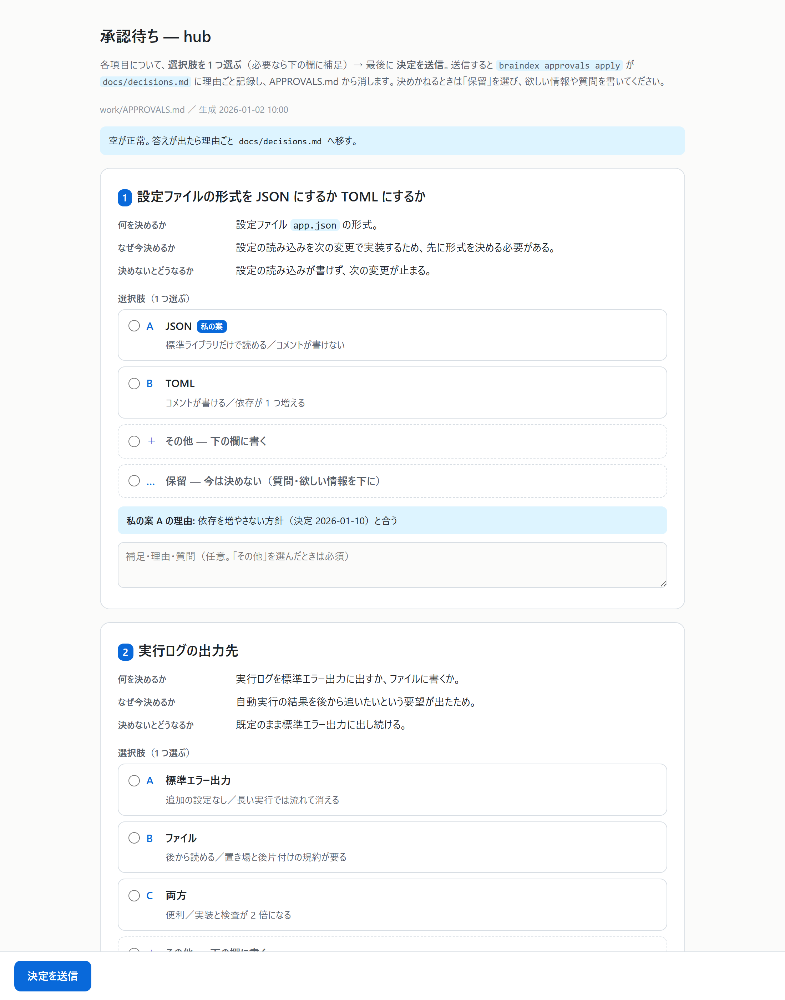
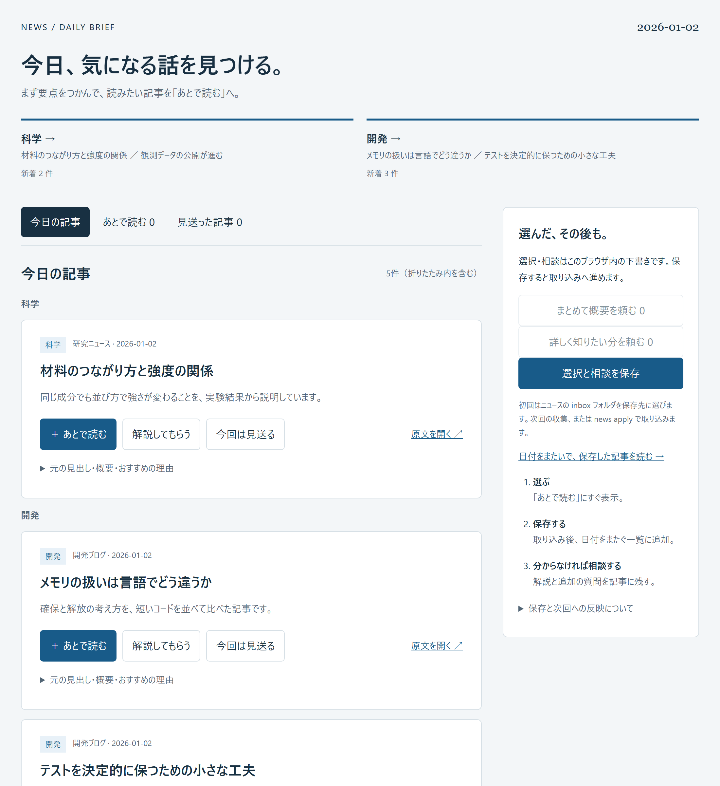
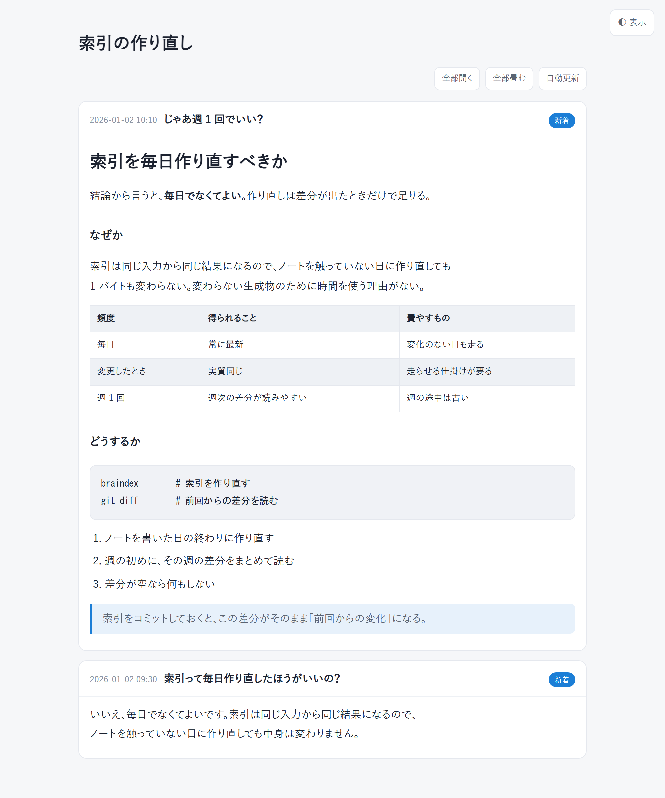
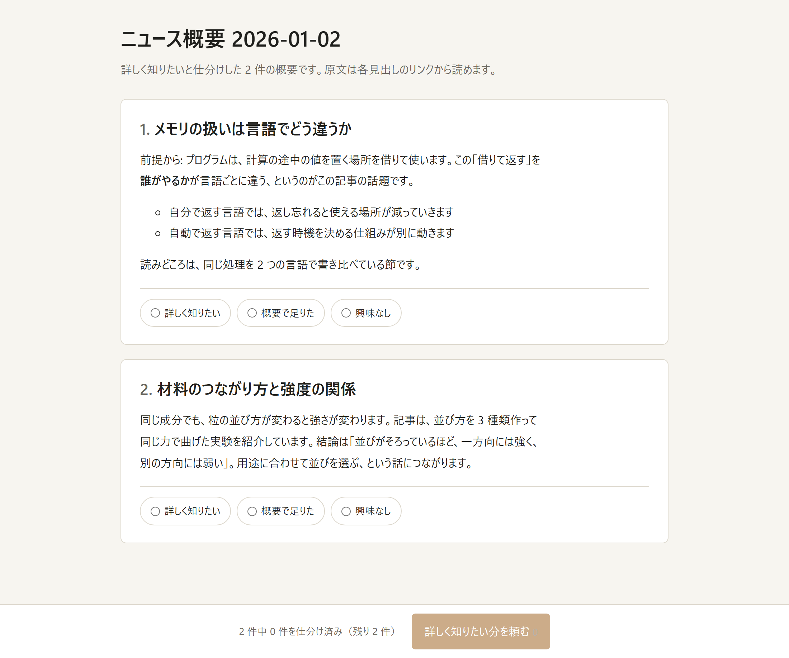
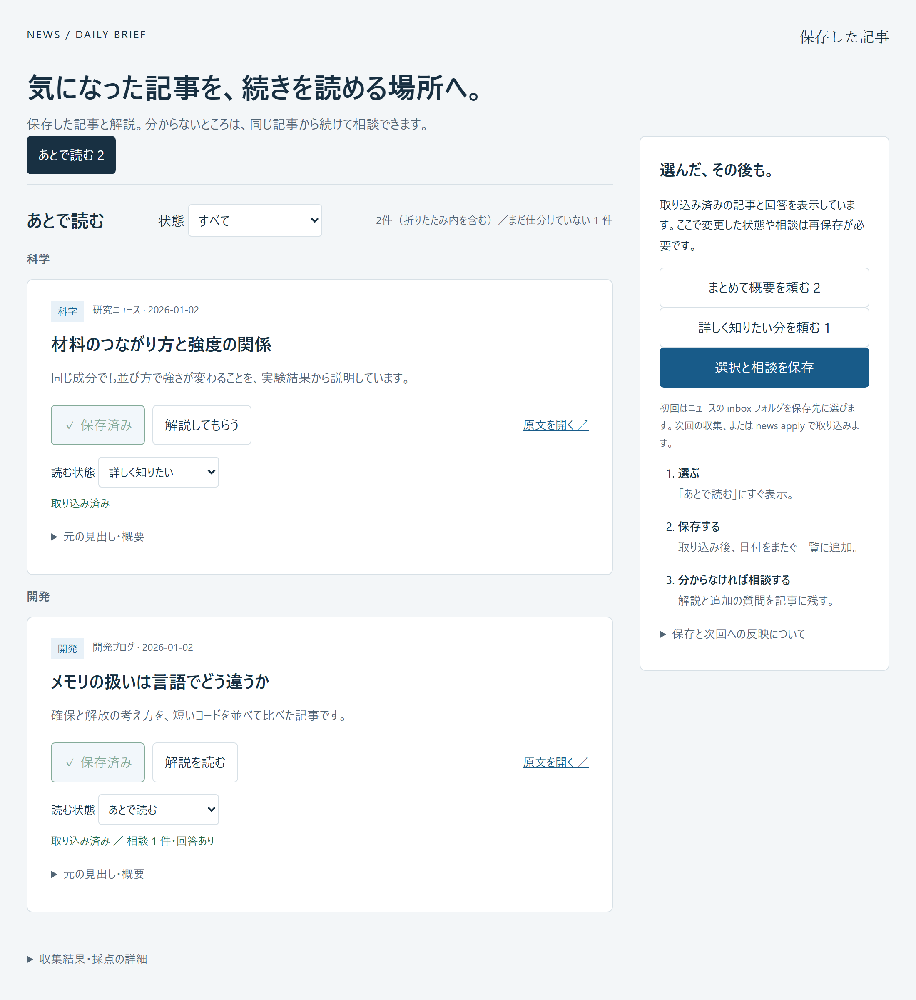
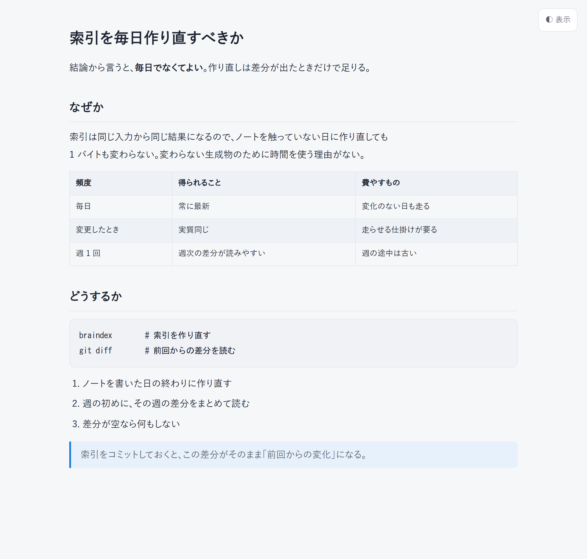

# braindex

[](https://github.com/pilefort/braindex/actions/workflows/ci.yml)

**Markdown ノートの索引を、LLM なし・依存なし・決定的に作るリポ横断の CLI。**

複数の git リポジトリに散らばった Markdown ノート（`docs/notes/`・`docs/decisions.md`）を、コピーせずに 1 枚の索引
`catalog.md` にまとめる。索引を grep して当たりを付け、パスの先の実ファイルを読む。索引に無ければ `braindex search <語>` で本文を引き、
「無い」と言う前に `braindex diagnose` で読めなかった範囲が無いか確かめる。索引をコミットすれば、再生成したときの
`git diff` がそのまま「前回からの差分」になり、週次レビューの材料になる。

**誰のための道具か**: Claude Code を日常的に使い、リポジトリごとに知識や wiki を整えている人。索引が中核で、その周りに
週次レビュー・振り返り（セッションの訂正率）・ニュース・学習の提案がある。**Claude Code 専用**で、他のコーディングエージェントの
ログには対応しない。既定は利用者の置き場を変えない機能だけで、規約への乗り換えは選んだときだけ（[段階的な取り込み](#段階的な取り込み)）。

コマンドごとの詳しい説明は [`manual/`](manual/README.md) にある。

## 画面

索引・検索・診断は端末の中で終わるが、**人が読む・選ぶ・決める**ところは HTML を書き出して既定のブラウザで開く。
どれも 1 枚で完結した HTML をローカルに置くだけで、常駐するサーバも外部への送信も無い。
以下は架空のサンプルから作った実物で、`BRAINDEX_SCREENSHOT=1 go test ./internal/screenshots` で作り直せる。

**判断待ちを聞く（`braindex approvals serve`）** — `work/APPROVALS.md` の 5 欄がそのまま質問になる。選んで送ると
`docs/decisions.md` に理由ごと記録され、承認待ちから消える。



**ニュースを選ぶ（`braindex news`）** — 関心で採点した新着を、あとで読む／今回は見送る／解説してもらう、で仕分ける。
選んだ結果はブラウザの中に残り、書き出して次の収集で取り込む。



**回答を読む（`braindex answer -append`）** — 同じ話題への回答が上に積まれ、開いたままのタブに続きが出る。



<details>
<summary>ほかの画面（概要の仕分け・保存した記事・1 枚ものの回答）</summary>

**概要を読んで仕分ける（`braindex news overview`）** — まず概要だけ読み、詳しく知りたい分をまとめて頼む。



**保存した記事と相談（`braindex news reading`）** — 日付をまたいで残る一覧。読む状態を変え、分からないところを続けて相談できる。



**1 枚ものの回答（`braindex answer`）** — Markdown 1 ファイルを自己完結の HTML にする。



</details>

## 構成

`root`（既定は hub の親ディレクトリ）の直下にリポジトリを並べ、そのうち 1 つを hub にする
（`<group>/<name>` のように 1 段はさんで並べているなら、設定に `"repo_depth": 2` を書く）。
hub が持つのは索引と週次レビューだけで、知識の正本は各リポに残る。

```text
parent/                            ← braindex.json の root（既定 ".."＝hub の親）
├── hub/                           ← 索引を置くリポ。braindex はここで実行する
│   ├── braindex.json              設定（root / notes_dirs / extra / repo_depth ＋ 足した機能の節）
│   ├── index/catalog.md           ■ 索引：1 ノート 1 行（日付・種別・タイトル・要旨・パス）。先頭に走査の記録
│   ├── index/changes.json         本文の変更の記録（内容ハッシュと観測日。索引の行が変わらない更新を見分ける）
│   ├── news/                      ニュースの置き場（既定で入る。作業ファイルは .gitignore が除外）
│   ├── .claude/skills/            判断を埋めるスキル（retro は既定。他は機能ごとに入る）
│   ├── docs/  work/               hub 自身のノートと作業状態（-add conventions）
│   ├── work/review/               週次レビューの下書き（-add review）
│   └── work/learn/answers.json    学習候補への回答（braindex learn answer が書く）
├── alpha/                         ← 各プロジェクトのリポ。知識の正本はこちら
│   ├── docs/notes/**/*.md         索引に載る
│   ├── docs/decisions.md          索引に載る（最新の記録日・件数つきタイトル・末尾の決定 1 件）
│   └── work/ISSUE-*.md            braindex lint が検査する（索引には載せない）
└── beta/
```

## セットアップ

```sh
go install github.com/pilefort/braindex/cmd/braindex@latest   # Go 1.26 以降。依存は標準ライブラリのみ
mkdir hub && cd hub
braindex init                                  # 索引の設定(README・CLAUDE.md・braindex.json)と retro・news・schedule
git init && git add . && git commit -m "hub"   # 索引の diff を「前回からの差分」にするため git 管理下に置く
braindex                                       # 索引 index/catalog.md を生成
```

これで索引が動く。**索引はコミットする**（git 管理下にないと `braindex review` の増減が常に 0 件になる）。
hub の外のリポで作業するセッションからも引かせる設定は [manual/init-update.md](manual/init-update.md#エージェントに横断検索させる)。

## 段階的な取り込み

全部を一度に入れる必要はない。入口は「何を約束するか」で 3 つに分かれ、前の入口の設定を捨てずに足せる（2026-09-05・`docs/decisions.md`）。

```text
braindex init（既定）                約束: 利用者の置き場と書き方を変えない
├── core        索引（braindex.json の root・notes_dirs・extra／README・CLAUDE.md・.gitattributes）
├── retro       振り返り（設定 retro 節・skill retro）              材料: Claude Code のセッションログ（既定の置き場）
├── news        ニュース（設定 news 節・news/feeds.example.json）   材料: フィードの URL（news/feeds.json に書く）
└── schedule    定期実行（設定 schedule 節。jobs は retro check・news fetch。review は足したら加わる）
braindex init -add conventions      約束: 新しく書くノートを規約に寄せる（docs/・work/・skill 3 本・approvals 節）← 唯一の「乗り換え」
└── braindex init -add review       週次レビュー（skill braindex-review・work/review/・review 節と job）。conventions を自動で含める
braindex init -add all              フル: 上の全部。learn（学習の提案）は配布物が無いので、材料が揃えば `braindex learn` で動く
```

機能は `-add <機能>` で個別にも足せる（一覧は `braindex init -list`）。既存ファイルは上書きせず、`braindex.json` には無い節と
その機能の job だけ足すので、何度実行しても安全。`braindex update` は足した機能の分だけ追従する。

| 入口 | 要るもの | 得られること |
|---|---|---|
| `braindex init` | 既存のノート。規約の乗り換えは不要 | `index/catalog.md`（別のリポで済ませたことを grep で引ける。`search` で本文も引け、`diagnose` で走査の状態を確かめられる）・訂正率の常時計測・関心で選んだニュースの選別・その定期実行 |
| `-add conventions` | 新しくノートを書く場所を規約に寄せる意思 | 決定 3 段・ISSUE・TODO の形が揃い、`lint`・`approvals` が使える |
| `-add review` | conventions と hub の git 管理 | 前回からの差分・放置 TODO・アーカイブ候補の下書き（週次） |
| `-add all` | 上の全部 | skill 5 本と全節。`braindex learn` の材料も揃う |

各リポの骨格（`docs/notes/`・`docs/decisions.md`・`work/`）は `braindex init -repo <リポ>` で置く。

## コマンド

| コマンド | 入力 | 出力 | 手引き |
|---|---|---|---|
| `braindex` | `<root>/*/docs/notes/**/*.md`・`<root>/*/docs/decisions.md`（`*` はリポ。`repo_depth: 2` なら `*/*`） | `index/catalog.md`（先頭に走査の記録）・`index/changes.json`（本文の変更の記録） | [generate](manual/generate.md) |
| `braindex search` | 各リポのノート本文（索引と同じ走査規則） | 語を含む行の「パス:行: 内容」と確認できなかった範囲（stdout・`-json`） | [search](manual/search.md) |
| `braindex diagnose` | 設定・いまの走査・保存済みの索引 | 何を見に行き、何が読めて、索引が何を取りこぼしているか（stdout・`-json`。索引もノートも書き換えない） | [diagnose](manual/diagnose.md) |
| `braindex init` | 埋め込みのテンプレ | hub の骨格（既定は索引＋retro・news・schedule。`-add <機能>` で足す・`-repo` で各リポの骨格） | [init-update](manual/init-update.md) |
| `braindex update` | 埋め込みのテンプレ・台帳 `.braindex/template.json` | 足した機能の分だけ追いついた雛形（編集済みは `<名前>.new`）と `index/catalog.md` | [init-update](manual/init-update.md) |
| `braindex review` | 索引の前回コミット・各リポの `git log`・`work/TODO.md` | `work/review/<今日>.md` | [review-lint](manual/review-lint.md) |
| `braindex lint` | `<root>/*/work/ISSUE-*.md`・ノート | 指摘（stdout）と終了コード | [review-lint](manual/review-lint.md) |
| `braindex retro` | Claude Code のセッションログ（`~/.claude/projects/*/*.jsonl`） | 率の表（stdout）・ダイジェスト（一時ディレクトリ） | [retro](manual/retro.md) |
| `braindex news` | `news/feeds.json` のフィード（GET）と関心の出典（索引・セッション・`news/keep/`） | `news/digest_<日付>_<層>.md` と選別 UI の同名 `.html` | [news](manual/news.md) |
| `braindex learn` | 索引・ノート本文・セッションログ・`news/keep` と訂正辞書・回答 `work/learn/answers.json` | 学習の提案（本文照合つき。Markdown・`-json`）。`learn answer` で候補に「既知・不要・後で」を返す | [learn](manual/learn.md) |
| `braindex approvals` | `work/APPROVALS.md` | ブラウザのフォーム → `docs/decisions.md` への追記 | [tools](manual/tools.md) |
| `braindex answer` | Markdown 1 ファイル（`-append` なら話題ごとのスレッド） | 自己完結 HTML（一時置き場・既定ブラウザで開く） | [tools](manual/tools.md) |
| `braindex explain` | 解説の Markdown 1 ファイルと、隣に置いた図の `.svg` | 目次・埋め込んだ図・表から描いたグラフつきの自己完結 HTML（一時置き場・既定ブラウザで開く） | [tools](manual/tools.md) |
| `braindex verify` | GitHub リポ・arXiv ID・URL・逐語引用 | 照合の結果（stdout・`-json`） | [tools](manual/tools.md) |
| `braindex scope` | `index/catalog.md`（`-dir` ならディレクトリ配下の `*.md`） | 矛盾検査の走査対象（chunk 分割・stdout・`-json`） | [tools](manual/tools.md) |
| `braindex schedule` | 設定の `schedule` 節 | OS のスケジューラへの登録。macOS の hub は `~/Documents`・`~/Desktop`・`~/Downloads` の下を避け、ホーム直下の `~/<名前>/` などに置く | [schedule](manual/schedule.md) |

終了コードは共通で **0 成功／1 失敗（結果を書かない）／2 警告つき完了（結果は書いたが、飛ばしたものや取りこぼしがある）**。
3 を使うのは `retro check`（閾値超え）と、`approvals serve`・`approvals wait`（時間切れ）だけ。場面ごとの表は [manual/README.md](manual/README.md#終了コード共通)。
フラグの要約は `braindex -h`、各コマンドは `braindex <コマンド> -h`。

## 設計

1. **指す、コピーしない。** 知識の正本は各リポにある。索引はパスで指すだけなので、正が 2 つにならない。
2. **索引は決定的。LLM を使わない。** 同じ入力からは常にバイト一致の索引が出る。だから索引をコミットでき、diff が意味を持つ。
   周辺機能（振り返る・知る）は LLM を採点や要約の補助に使ってよいが、取得と計測は規則ベース（LLM を使わず規則と閾値だけ）で行い、判断は人に残す。
3. **寿命で分ける。** 蓄積するもの（`docs/`）と揮発するもの（`work/`）を混ぜない。索引は前者だけを見る。

やらないこと: 意味検索・ベクトル DB（recall 失敗の実例が出るまで入れない）／LLM による索引の要旨生成・索引更新／
ノート本文・セッション内容の外部送信（ニュースの取得は GET のみ）／ネタ帳（索引・レビュー・ニュースとは独立した機能で、テンプレの核ではない）。

どの機能が安定していて、どれが試用中（既定値・辞書・閾値を試用後に見直す前提）かは [manual/README.md の安定度](manual/README.md#安定度)。
Karpathy の LLM wiki 型との対応・リポジトリの地図・版の状態は [manual/design.md](manual/design.md)。
理由と却下案は作者の設計メモ `docs/decisions.md`、開発の決まりは [`CONTRIBUTING.md`](CONTRIBUTING.md)。

## ライセンス

MIT（`LICENSE`）。
